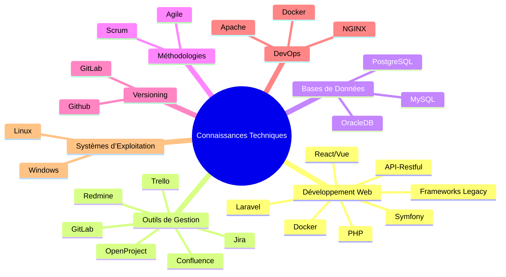

>[Revenir au début](https://github.com/IngJuanRojas/about-me-Es/tree/main)

## **Connaissances Techniques :**
- **Développement Web :** PHP, Frameworks Legacy, Symfony, Laravel, React/Vue, API-Restful, Docker
- **Outils de Gestion :** Jira, Trello, Confluence, Redmine, OpenProject, GitLab
- **Bases de Données :** MySQL, PostgreSQL, OracleDB
- **Méthodologies :** Scrum, Agile
- **Versioning :** GitLab, Github
- **DevOps :** Docker, Apache, NGINX
- **Systèmes d’Exploitation :** Linux, Windows

### **Carte Mentale des Connaissances Techniques**

## **Compétences Interpersonnelles**
- **Leadership et Gestion d'Équipes** : Capacité à diriger et motiver les équipes, déléguer efficacement les tâches et gérer les ressources pour atteindre les objectifs dans les délais impartis.
- **Communication Efficace** : Aptitude à traduire les besoins techniques en termes compréhensibles pour les parties prenantes et les utilisateurs, assurant une compréhension claire des objectifs et des exigences.
- **Résolution de Problèmes** : Approche proactive pour identifier, analyser et résoudre les problèmes techniques et de gestion, minimisant les risques et assurant la continuité du projet.
- **Pensée Stratégique** : Vision pour développer des stratégies alignant la technologie avec les objectifs de l'entreprise, maximisant l'efficacité et favorisant l'innovation.
- **Gestion du Changement** : Expérience dans la gestion du changement organisationnel, en mettant en œuvre de nouvelles technologies et méthodologies sans affecter la productivité de l'équipe.
- **Collaboration et Travail d'Équipe** : Compétence pour collaborer avec des équipes multifonctionnelles, assurant un environnement de travail cohésif et orienté vers le succès du projet.
- **Adaptabilité** : Capacité à s'ajuster rapidement à de nouveaux environnements, technologies et méthodologies, garantissant la livraison efficace de solutions.
- **Planification et Organisation** : Compétence pour planifier, organiser et prioriser les tâches, tout en maintenant la qualité et en respectant les délais établis.

## **Formation Académique**

**Ingénieur en Informatique**  
*Université Rómulo Gallegos, Venezuela*  
*2010*

**Développeur Web**  
*IBM, Venezuela*  
*2012*

**Certifications en Data Analytics & Digital Marketing**  
*IAB Spain, Espagne*  
*2015*

## **Réalisations**

### **Gestion de Produits**
- **Développement de la Vision du Produit** : J'ai converti les besoins des parties prenantes en fonctionnalités produit, augmentant la satisfaction client de 20 %.
- **Priorisation Efficace du Backlog** : J'ai défini et priorisé le backlog basé sur le retour client, améliorant l'efficacité du développement de 25 %.
- **Leadership en Innovation Produit** : J'ai dirigé l'adoption de nouvelles technologies et méthodologies, augmentant l'adaptabilité et l'évolutivité du produit.

### **Gestion Technique**
- **Optimisation des Processus Techniques** : J'ai mis en œuvre des améliorations dans l'architecture du produit, ce qui a entraîné une augmentation de 30 % de l'efficacité de l'équipe de développement.
- **Coordination et Motivation des Équipes** : J'ai géré des équipes multiculturelles, atteignant une forte cohésion et motivation, et dépassant constamment les objectifs de livraison de produit.
- **Adoption de Symfony** : J'ai dirigé l'intégration de Symfony dans l'infrastructure existante, réduisant le temps de développement de 40 %.
- **Réduction des Erreurs de Production** : J'ai introduit une méthodologie de test améliorée, réduisant les erreurs en production de 40 %.
- **Mise en Œuvre de Solutions Scalables** : J'ai développé et déployé des solutions scalables basées sur Docker, améliorant la gestion des déploiements et l'efficacité opérationnelle.
- **Amélioration de la Gestion des Données** : J'ai mis en place des solutions avancées de gestion des données, améliorant la cohérence et la qualité des informations dans les applications critiques, contribuant ainsi à la réduction de plus de 10 millions d'enregistrements incohérents dans la base de données.

## **Langues**
- **Espagnol** : Natif
- **Français** : Avancé
- **Anglais** : Avancé
- **Portugais** : Basique
