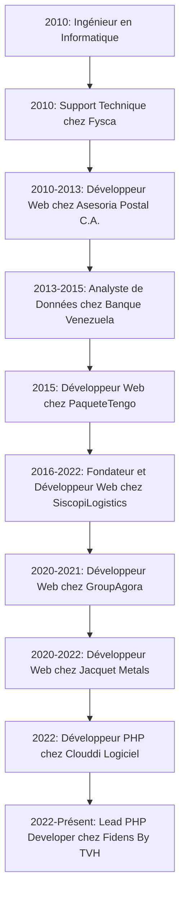

>[Revenir au début](https://github.com/IngJuanRojas/about-me-Fr/tree/main)

# **Expérience Professionnelle**

Cette section fournit un résumé détaillé de mon expérience professionnelle, mettant en évidence mes rôles dans le développement web et la gestion de produits. Ci-dessous, mes responsabilités, réalisations quantifiables et compétences pertinentes pour chaque poste sont décrites.

## **Lead Developer / Scrum Master**
**Fidens By TVH**  
*Septembre 2022 - Présent*

- **Gestion des Produits** : J'ai dirigé l'équipe de développement dans la mise en œuvre d'applications web en utilisant Symfony et React. J'ai coordonné la planification et l'exécution des sprints, alignant les livraisons avec la vision du produit.
- **Innovation Technique** : J'ai mis en place une architecture basée sur Docker pour améliorer la scalabilité et la gestion des déploiements, réalisant une réduction de 30 % du temps de configuration de l'environnement.
- **Amélioration des Processus** : J'ai introduit des méthodologies agiles qui ont augmenté l'efficacité de l'équipe de 25 %, facilitant la communication et le suivi des tâches via Jira et Confluence.
- **Scrum Master** : Facilitateur des cérémonies Scrum, assurant la clarté des objectifs et la résolution des obstacles.

**Résultats Quantifiables :**
- Augmentation de 30 % de l'efficacité de l'équipe de développement.
- Réduction du temps de configuration de l'environnement de 30 %.
- Amélioration de 25 % de l'efficacité grâce aux méthodologies agiles.

## **Développeur PHP**
**Clouddi Logiciel, France**  
*2022*

- **Développement Backend** : Création de nouvelles fonctionnalités dans une application basée sur Symfony 5, intégrant des améliorations qui ont augmenté la stabilité du système de 20 %.
- **Collaboration Interdisciplinaire** : J'ai travaillé en étroite collaboration avec l'équipe frontend pour garantir une intégration fluide et cohérente des nouveaux modules.

**Résultats Quantifiables :**
- Augmentation de 20 % de la stabilité du système.
- Intégration fluide des nouveaux modules en collaboration avec l'équipe frontend.

## **Développeur Web**
**Jacquet Metals, France**  
*2020 - 2022*

- **Support et Développement** : Maintenance et amélioration des applications web existantes, avec un focus sur la correction des erreurs et la mise en œuvre de nouveaux modules de rapports.
- **Optimisation des Données** : J'ai développé des structures de données et des rapports statistiques qui ont amélioré la précision et l'efficacité dans la prise de décisions.

**Résultats Quantifiables :**
- Amélioration de la précision dans la prise de décisions.
- Mise en œuvre de nouveaux modules de rapports.

## **Freelance et Fondateur**
**ChronUp Solutions et SiscopiLogistics**  
*2016 - 2022*

- **Fondateur de SiscopiLogistics** : J'ai développé un système complet de contrôle des opérations logistiques, gérant l'architecture, le développement, et le déploiement de solutions PHP et MySQL pour des clients aux États-Unis, au Venezuela, au Panama et en Colombie.
- **Développement Web Freelance** : J'ai fourni des solutions de développement web, incluant le design, la mise en œuvre et les stratégies de marketing digital pour divers clients.

**Résultats Quantifiables :**
- Création d'un système de contrôle des opérations logistiques pour plusieurs pays.
- Fourniture de solutions de développement web et de stratégies de marketing digital pour divers clients.

## **Développeur Web**
**GroupAgora, France**  
*2020 - 2021*

- **Support Applicatif** : En mission avec Jacquet Metals, j'ai fourni un support dans la correction des erreurs et le développement de nouveaux modules, améliorant l'efficacité opérationnelle du client.

**Résultats Quantifiables :**
- Amélioration de l'efficacité opérationnelle du client grâce au développement de nouveaux modules.

## **Développeur Web**
**PaqueteTengo, Venezuela**  
*2015*

- **Développement Intégral** : Conception et développement complet du système d'opérations de l'entreprise, incluant les bases de données, le backend, le frontend et le support opérationnel.

**Résultats Quantifiables :**
- Développement complet du système d'opérations de l'entreprise.

## **Développeur Web**
**Asesoria Postal C.A., Venezuela**  
*2010 - 2013*

- **Développement Full Stack** : Design, développement et mise en œuvre de modules web, de statistiques, et de bases de données, impulsant de nouveaux modèles commerciaux et stratégies digitales.

**Résultats Quantifiables :**
- Mise en œuvre de modules web et de stratégies digitales qui ont impulsé de nouveaux modèles commerciaux.

## **Analyste de Données**
**Banque Venezuela, Venezuela**  
*2013 - 2015*

- **Gestion des Bases de Données** : J'ai administré des bases de données Oracle et développé des rapports statistiques qui ont amélioré la prise de décisions internes de l'organisation.

**Résultats Quantifiables :**
- Développement de rapports statistiques qui ont amélioré la prise de décisions internes.

## **Support Technique**
**Fysca, Venezuela**  
*2010 (Stage)*

- **Maintenance et Opération** : Maintenance et opération des équipements SmartMatic, fournissant un support technique dans des environnements exigeants.

**Résultats Quantifiables :**
- Maintenance et opération efficaces des équipements SmartMatic dans des environnements exigeants.

# **Formation Académique**

**Ingénieur en Informatique**  
*Université Rómulo Gallegos, Venezuela*  
*2010*

**Master of Science in Management**  
*Caribbean International University*  
*2012 - 2015*

**Certifications en Data Analytics & Digital Marketing**  
*IAB Spain, Espagne*  
*2015*

## **Diagramme de Flux de l'Expérience Professionnelle**

Ci-dessous est présenté un diagramme de flux montrant la progression de ma carrière professionnelle :

---
